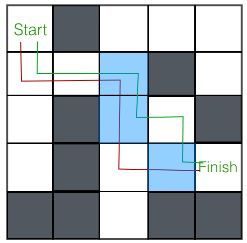

# Dynamic Programming

You will have 90 minutes to complete this assessment. Please rename your project to *your* first and last name before you zip it up and submit it on Progress Tracker. 

`firstname_lastname`

Run "bundle exec rspec" on your terminal to check how many specs you've passed.

### Initialize 
Define your cache instance varialbe in `initialize` if you have to.

```ruby
def initialize
  @my_cache = {}
end
```

### Blair numbers
*Blair numbers* is defined as below :

- The first Blair number, <i>b<sub>1</sub></i>, is 1,
- The second Blair number, <i>b<sub>2</sub></i>, is 2,
- The <i>k</i>th Blair number is the sum of the previous two Blair numbers plus the *k* - 1st odd number. For example, <i>b<sub>3</sub></i> = <i>b<sub>2</sub></i> + <i>b<sub>1</sub></i> + 2nd odd = 1 + 2 + 3 = 6.

Your job in this question is to write `blair_nums(n)`, which should return the *nth* Blair number.

### Frogs Hopping
A frog is sitting at the bottom of a staircase with *n* stairs. Tiny little frog can only jump so many steps at once. In particular, it can only hop 1, 2, or 3 steps at a time.


Given this information, write a function to return the number of ways the frog can get to the top of the stairs. For example, if there are two stairs in the staircase, there are two ways for the frog to get to the top: hop 2 steps, or hop 1 step and then hop 1 step again. For *n* = 3, there are 4 ways: [1, 1, 1], [1, 2], [2, 1], and [3].

Build the cache that you need using `frog_cache_builder`, and return the correct entry from that cache.

### Knapsack

Knapsack Problem: write a function that takes in an array of weights, an array of values, and a weight capacity and returns the maximum value possible given the weight constraint.  

For example: if weights = [1, 2, 3], values = [10, 4, 8], and capacity = 3, your function should return 10 + 4 = 14, as the best possible set of items to include are items 0 and 1, whose values are 10 and 4 respectively.  Duplicates are not allowed -- that is, you can only include a particular item once.

### Maze Solver

You're given a maze and asked to find a path from its starting location to the finish. The maze is 2-dimensional, and will be represented by an array of characters. Empty squares are represented with `" "`, blocked spaces with `"X"`, your location with `"L"`, and the finish with `"F"`.  Here's an example:


Write a function that takes in the maze array, starting position, and ending position, and returns an array of moves from start to finish. One possible return value for the example above is [[0, 0], [1, 0], [1, 1], [1, 2], [2, 2], [3, 2], [3, 3], [3, 4]]. There are a few other valid paths as well -- any one of them is a satisfactory return value.

This may not seem as straightforward an application of recursion as the previous examples. True! But there is a recursive structure here. Take note of a couple things:

1. Whatever position we find ourselves at in the maze, we have up to 4 choices for our next move: up, down, left, or right. Some of these may be blocked or out of bounds, however.
2. There's a base case here. What is it? Hint: for which position(s) in the maze do we already know the shortest possible path?

This gives us a pretty clear outline for our recursive algorithm. We'll check for our base case and return early if we find it. Otherwise, we'll run our algorithm on all the legal next moves and choose the one that returns the shortest path.

Conceptually, this makes sense. How do we implement it? Let's outline a purely recursive function before introducing any optimizations. Start with the base case. If you're at "F", you should return an array with just the coordinates of the "F" square.

```ruby
def maze_solver(maze)
  # Implement the base case here
end
```
Next, write the recursive case. Check all valid moves and choose the one that gives you the shortest path to the finish. Remember to add your current position's coordinates to the path!  

Try your function out on the example maze we gave above. Do you get the expected output? If so, you're ready to optimize!

What's the time complexity of `maze_solver`? Think about a relatively simple case: an `n x n` maze with no obstacles (i.e., all " " characters). About how many choices will we have for each move that we make? Make a rough sketch of a decision tree to help you visualize how many calls are being made. Come up with at least a good lower bound on the time complexity.

Now let's improve that time complexity by using dynamic programming. Let's think about what information we need to cache. Throughout the course of our recursion, we'll encounter the same square over and over again. For example, look at our example maze and two paths that we'll end up trying:



One approach would be to store the entire shortest path from each position to the end point in a hash. However, this would take up an enormous amount of space. Instead, for each position in the maze, let's only store the *next move* in its optimized path.

Take a top-down approach for this one. Create the instance variable that you need, `@maze_cache`, initializing it to an empty array or hash. An 2-dimensional array the same size as the maze is a straightforward choice in this case -- you'll be able to refer more easily to a given coordinate in the maze. Now, since you won't get the actual maze until the `maze_solver` function is run, you won't be able to populate any base cases to your `@maze_cache` on initialization of the `DynamicProgramming` object. That's okay, though. Set it up with this work-around:

```ruby
class DynamicProgramming
  def initialize
    @maze_cache = []
  end

  def maze_solver(maze, start_pos, finish_pos)
    # Call populate_maze_cache to set up the maze cache
    # Call and return or parse the result of solve_maze
  end

  private
  def populate_maze_cache(maze)
    # Create a maze_cache of the correct size
    # Record base case(s) in the cache
  end

  def solve_maze(maze, start_pos, finish_pos)
    # Do the actual work of solving the maze
  end
end
```
This is all the setup you need! Now, put your dynamic programming skills to work -- check the cache and record new results in the cache as you go. Try running your new code on the example maze. Does it still work? Also try running your code on the big example we gave. It should return in a few seconds this time!

How would you approach this problem using a bottom-up implementation? Hint: you may want to record *previous* steps to a solution instead of *next* steps.